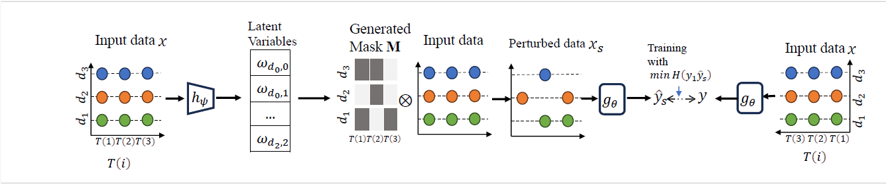

# IndMask
Implementation of IndMask, an inductive explanation method for multivariate time series black-box models

> IndMask: Inductive Explanation for Multivariate Time Series Black-box Models. Seham Nasr and Sandipan Sikdar. Accepted at ECAI 2024

 ***Please cite our paper in any published work that uses any of these resources.***

 ~~~
 Coming soon
 ~~~

## Abstract

In this paper, we introduce **IndMask**, a framework for explaining decisions of black-box time series models. While there exists a plethora of methods for providing explanations of machine learning models, time series data requires additional considerations. One needs to consider the time aspect in the explanations as well as deal with a large number of input features. Recent work has proposed explaining a time series prediction by generating a mask over the input time series. Each entry in the mask corresponds to an importance score for each feature at each time step. However, these methods only generate instancewise explanations, which means a mask needs to be computed for each input individually, thereby making them unsuited for inductive settings, where explanations need to be generated for numerous inputs, and instancewise explanation generation is severely prohibitive. 
Additionally, these methods have mostly been evaluated on simple recurrent neural networks and are often only applicable to a specific downstream task. 
Our proposed framework **IndMask** addresses these issues by utilizing a parameterized model for mask generation. 
We also go beyond recurrent neural networks and deploy **IndMask** to transformer architectures, thereby genuinely demonstrating its model-agnostic nature.  
The effectiveness of **IndMask** is further demonstrated through experiments over real-world datasets and time series classification and forecasting tasks.
It is also computationally efficient and can be deployed in conjunction with any time series model.

Consider a multivariate time series $X$ with $d_i$ variables and $t_i$ time states. Also provided is a black-box time series classifier model $g_{\theta}$ which takes $X$ as input and predicts a class $y$. The goal is to generate an explanation for the decision in terms of a mask of the same dimension as the input. The model uses a neural network $h_{\psi}$ to predict latent variables, which are then used to sample a mask. The mask is then used to obtain a perturbed input $X_s$ which in turn is used as input to $g_{\theta}$ to obtain $y_s$ as output. $\psi$ is optimized by minimizing the cross entropy between $y$ and $y_s$.

## Running the code
~~~
pip install requirements.txt
~~~

> The black-box models are available in Models/HAR and Models/MIMIC

> MIMIC-III is a private dataset. For the following, you need to have the MIMIC-III database running on a local server. For more information, please refer to the official MIMIC-III documentation.

> Once you have downloaded and pre-processed the dataset, you can put it in the folder *Datasets/MIMIC/*. Save the data in two pickle files - *inputs.pkl* which contains the features as tensors and *true_labels.pkl* as tensors
> A dummy dataset is provided in the MIMIC folder

To replicate results in the paper run -

~~~
python main.py -d HAR -l local # local explanations HAR
~~~
~~~
python main.py -d HAR -l global # Inductive experiments HAR
~~~
~~~
python main.py -d MIMIC -l local # local explanations MIMIC
~~~

